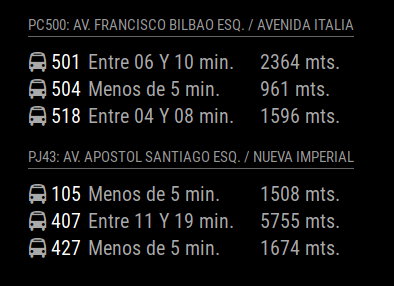

# MMM-TransantiagoCL-Paraderos
This a module for the [MagicMirror](https://github.com/MichMich/MagicMirror). It will show photos from a directory.

This module read the upload directory and show images from there.


## Installation
1. Clone this repository inside your MagicMirror's `modules` folder
   `cd ~/MagicMirror/modules`
   `git clone https://github.com/roramirez/MMM-TransantiagoCL-Paraderos.git`.

## How show it


## Config
The entry in `config.js` can include the following options:


| Option           | Description
|----------------- |-----------
| `busStop`        | *Required* The bus stop you want display the information. Find [information about this values](http://paraderos.cl/)
| `updateInterval` | *Optional* How often should update the data.<br><br>**Type:** `int`(milliseconds) <br>Default 60000 milliseconds (1 minute)


Here is an example of an entry in `config.js`
```
{
	module: 'MMM-TransantiagoCL-Paraderos',
    position: "left",
	config: {
		busStop: ["PG203", "PJ43"]
		updateInterval: 30000,
	}
},
```

Thanks to [Paraderos.cl](http://paraderos.cl/) and especially [Rodrigo Perez](https://twitter.com/bilsoncl)
